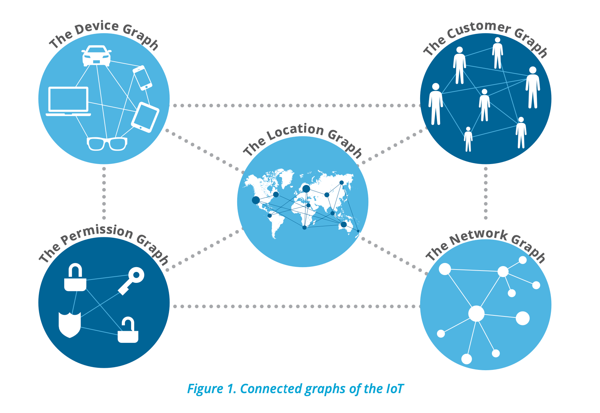

# Neo4j Graph of Things Tutorial

This tutorial introduces the basic concepts of the Graph of Things using Neo4j, a powerful graph database that enables you to model, store, and query relationships between data effectively. We will cover the basic types of nodes and relationships in an IoT scenario and provide sample queries to demonstrate both data retrieval and graph visualization capabilities.

## Acknowledgments and Data Source

This tutorial and the accompanying data are inspired by the [Graph of Things project on GitHub](https://github.com/GraphAlchemist/GraphofThings). The specific Cypher script and dataset used in this tutorial are located in the repository, under the path `data/GraphofThings.cyp`. We encourage you to explore the original repository for further insights and advanced scenarios in the Graph of Things context.

The Graph of Things project offers an extensive framework for understanding complex interactions within an IoT ecosystem using Neo4j. This tutorial aims to simplify and highlight some of the basic concepts and queries useful for beginners or those new to graph databases.




## Node Labels

In our Graph of Things model, we use the following node labels:

- `User`: Represents a persona, potentially from social media platforms like Facebook, LinkedIn, or Twitter. Users can have various properties such as age, email, and gender.
- `Human`: A subclass of `User` that interacts directly within the IoT environment. Humans can have devices and may interact with various locations.
- `Machine`: Represents devices within the IoT, such as wearables or mobile phones. Machines can have properties like type, id, and name.
- `Location`: Denotes a physical space, which could be an event location, store, park, etc. Locations must have latitude and longitude properties.
- `OperatingSystem`: Indicates major operating systems like Android or iOS. Machines run these operating systems.
- `Company`: Represents entities that manufacture devices or distribute operating systems.
- `Interest`: Used to categorize interests that may connect users, locations, or other entities.
- `LocationHier`: A hierarchical node that can represent various levels of spatial aggregation from locations to regions.

## Relationships

The model includes several types of relationships to connect the nodes:

- `USES`: A relationship from `Human` to `Machine`, indicating possession or usage of a device.
- `LOCATED`: Connects `Machine` to `Location` and can also link `Location` to `LocationHier`, indicating where a device is or how locations are related spatially.
- `FRIEND`: Implies a social connection, used between `User` or `Human` nodes.
- `RUNS`: Links `Machine` to `OperatingSystem`, specifying the OS version the machine is running.
- `MAKES`: Connects `Company` to `Machine`, indicating manufacturing relationships.
- `DISTRIBUTES`: Connects `Company` to `OperatingSystem`, indicating distribution rights or partnerships.


## Understanding Query Output: Table vs. Graph

In Neo4j, the output of a Cypher query can generally be viewed in two formats: as a table or as a visual graph. Understanding when and why to use each format can enhance how you interact with and analyze your data.

### Table Output

Table outputs are best used when you need to process or analyze specific data points from your nodes or relationships. This format is akin to traditional SQL query results, where the output is a structured table with columns and rows. Each row represents a record, and each column represents a property of the nodes or relationships queried.

- **Use Cases for Table Output:**
  - When you need a clear and concise display of specific attributes.
  - When performing aggregations or calculations.
  - When preparing data for reports or further statistical analysis.
  - When the relationship between the data points is not the primary concern, but rather the data itself.

- **Example Query Returning Table:**
  ```cypher
  MATCH (u:User)
  RETURN u.name AS Name, u.age AS Age, u.gender AS Gender, u.email AS Email

This query retrieves specific attributes of all User nodes and presents them in a tabular format, ideal for reviewing or exporting user data.

### Graph Output
Graph outputs visually represent the nodes and relationships as a connected network. This format is unique to graph databases and is particularly useful for understanding the interconnections and structures within your data.

- **Use Cases for Graph Output:**
    - When you need to visualize how entities are interrelated.
    - When exploring the data to understand complex patterns or to identify clusters.
    - When the connections between nodes are as important as the node properties themselves.
    - When presenting data to stakeholders to illustrate relationships in a more intuitive format.

- **Example Query Returning Graph:**
  ```cypher
    MATCH p=(u:User)-[:FRIEND]->(f:User)
    RETURN p

This query visualizes how users are connected via the :FRIEND relationship, allowing you to see the social network graphically.


## Basic Queries (Table)

Here are five basic queries to get you started:

1. **Retrieve All Users**
   ```cypher
   MATCH (u:User)
   RETURN u.name AS Name, u.age AS Age, u.gender AS Gender, u.email AS Email

2. **Find All Machines and Their Operating Systems**
    ```cypher
    MATCH (m:Machine)-[r:RUNS]->(os:OperatingSystem)
    RETURN m.name AS Device, os.name AS OperatingSystem, r.version AS OS_Version

3. **List All Human Users and the Devices They Use**
    ```cypher
    MATCH (h:Human)-[:USES]->(m:Machine)
    RETURN h.name AS Human, m.name AS Device, m.type AS Type


4. **Find Friends of a Specific User**
    ```cypher
    MATCH (u:User {name: "John Doe"})-[:FRIEND]->(f:User)
    RETURN f.name AS Friend_Name, f.email AS Friend_Email


5. **Events Attended by Users at a Specific Location**
    ```cypher
    MATCH (u:User)-[:USES]->(m:Machine)-[:LOCATED]->(l:Location {name: "Central Park"})
    RETURN u.name AS User, l.name AS Event, l.lat AS Latitude, l.lon AS Longitude

## Basic Queries (Graph)

Here are five queries that return graph results:

1. **Visualize a User and Their Network of Friends**
   ```cypher
    MATCH p=(u:User {name: "John Doe"})-[:FRIEND*1..2]-(friend)
    RETURN p


2. **Show How Humans Interact With Their Devices**
    ```cypher
    MATCH p=(h:Human)-[:USES]->(m:Machine)
    RETURN p


3. **Display the Locations Visited by a Specific User**
    ```cypher
    MATCH p=(u:User {name: "Alice Johnson"})-[:USES]->(m:Machine)-[:LOCATED]->(l:Location)
    RETURN p


4. **Visualize Devices and Their Operating Systems**
    ```cypher
    MATCH p=(m:Machine)-[:RUNS]->(os:OperatingSystem)
    RETURN p


5. **Interactions Between Companies and Their Products**
    ```cypher
    MATCH p=(c:Company)-[:MAKES|DISTRIBUTES]->(x)
    RETURN p


This markdown document provides a structured and easy-to-follow introduction to using Neo4j for a Graph of Things, making it suitable for educational purposes or as a starting point for new developers or data scientists exploring graph databases.

