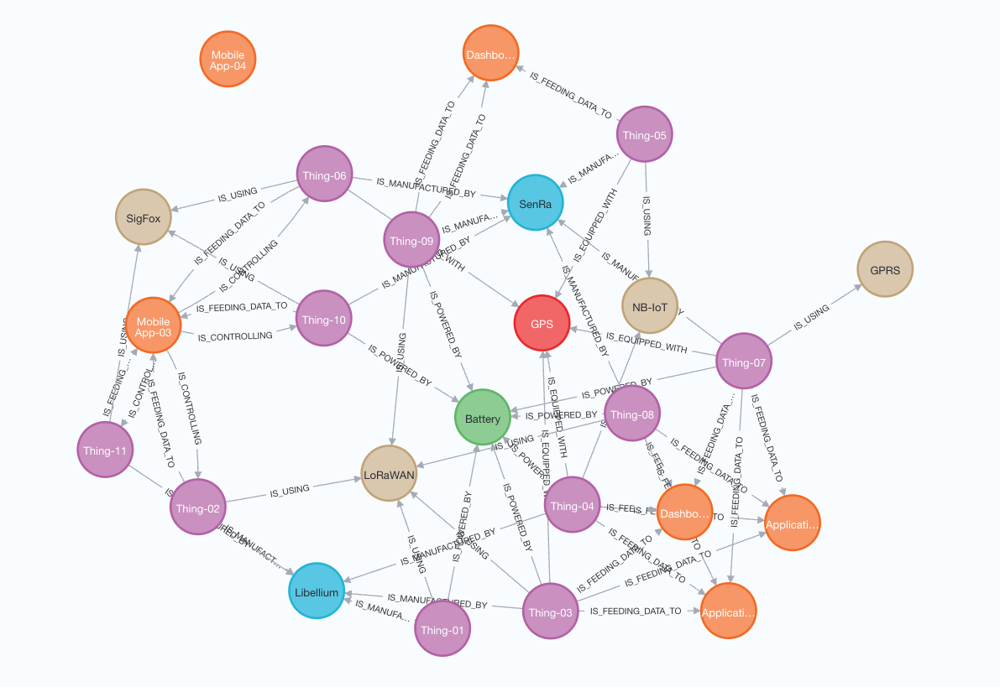

# IoT Data Modelling using Neo4j Graph Database

## Inspiration and Acknowledgments

This tutorial and the concepts discussed herein draw significantly from Mr. Mamun's article on Medium titled ["IoT Data Modeling in Neo4j Graph DB"](https://medium.com/@muntasirjoarder/iot-data-modeling-in-neo4j-graph-db-f5b57f377614). The article provides a foundational understanding of how graph databases can efficiently manage and visualize IoT data, highlighting the advantages of Neo4j for such applications.

Additionally, we have utilized resources and examples from Mr. Mamun's GitHub repository [NeoThings](https://github.com/muntasirjoarder/NeoThings), which offers practical implementations and further insights into the integration of Neo4j within IoT systems. 

## Objective of This Tutorial

The primary goal of this tutorial is to demonstrate how to create a simple but effective IoT data model in Neo4j. We will guide you through setting up your environment, creating nodes and relationships, and executing queries that reveal insightful patterns and connections in IoT data. Whether you are new to Neo4j or looking to expand your knowledge in graph databases with a focus on IoT applications, this tutorial is designed to provide a clear and practical approach to IoT data modeling.

We extend our gratitude to Mr. Muntasir Mamun for his pioneering work and for providing the community with valuable resources that serve as the basis for this tutorial. Let's embark on this learning journey to explore the dynamic capabilities of Neo4j in the world of IoT.

Here, we have ten(10) types of **nodes**. They are:

| Node | Description | Values | Properties |
| -----| ----------- | ------ | -----------|
| Thing | Thing is the actual IoT Device for which we are creating this data model | 11 Things configured. Thing01..Thing11 | {id,name,lat,lon} |
| Power | Power source for the Thing. | Battery and Solar | {id, name} |
| Thing Type | What type of Thing is it. | Soil Moisture, Water Quality, Light Control (NEMA 7-Pin) |{id, name} |
| Module | Any extra module attached to it? | GPS |{id, name} |
| Vendor | Vendor or Integrator for this Thing (ie in case of support and maintenance) | Vendor-1, Vendor-2 and Vendor-3 |{id, name} |
| Manufacturer | Who manufactured this Thing | Libellium, SenRa |{id, name} |
| Network | Which communication network this Thing is using | LoRaWAN, Sigfox, NB-IoT, GPRS |{id, name} |
| Sensor | A Thing can be composed of multiple sensors | Temperature, Heat, Infra Red |{id, name} |
| Application | These are the application which are using the Thing | Application-01, Dashboard-02, Mobile App-03, Mobile App-04, Application-05, Dashboard-06|{id, name} |
| Department | Departments of the organization which are using/interacting with the Thing through Applications | Information Technology, Field Services, Water Management |{id, name} |


Also we have ten(10) edges (ie. Relationships). They are:

| Edge | Description | Properties |
| -----| -----------| ------------|
|-[IS_POWERED_BY]-> (Power) | Represents how the Thing is powered by. Thing can be powered by Battery or Solar in our case | Battery: {lifestarts,lifefinish,installeddate}; If Solar then {dateinstalled,expectedinspectiondate} |
|[IS_USING]->|Which network the Thing is using. Relation can point to LoRaWAN, SigFox, NB-IoT or GPRS node|{appid,devid} if it is using LoRaWAN|
|[IS_COMPOSED_OF]->	| This Thing is composed of multiple sensors may be. For each sensor there will be a relationship. Like for example,  _(Thing)-[:IS_COMPOSED_OF]->(Heat Sensor)_ and _(Thing)-[:IS_COMPOSED_OF]->(Motion Sensor)_ And property for this relationship will hold the range for that sensor.|{low,high} ie the range|
|All other edges| | No properties defined |

## Steps to create Things Neo4j Database

1. The CSV files for **nodes** and **edges** are already created. You can just copy the Cypher queries and execute in order which will then create our IoT Graph Data Model in Neo4j Sandbox.

2. **Things**
```sh
LOAD CSV WITH HEADERS FROM "https://raw.githubusercontent.com/josephazar/graph_of_things/main/Neo4jThings/things.csv" AS csvLine
CREATE (`csvLine.identifier`:Thing {id: csvLine.identifier, name: csvLine.name, lat: csvLine.lat, lon: csvLine.lon })
```
3. **Applications**
```sh
LOAD CSV WITH HEADERS FROM "https://raw.githubusercontent.com/josephazar/graph_of_things/main/Neo4jThings/applications.csv" AS csvLine
CREATE (`csvLine.identifier`:Application{id: csvLine.identifier, name: csvLine.name})
```
4. **Manufacturers**
```sh
LOAD CSV WITH HEADERS FROM "https://raw.githubusercontent.com/josephazar/graph_of_things/main/Neo4jThings/manufacturers.csv" AS csvLine
CREATE (`csvLine.identifier`:Manufacturer {id: csvLine.identifier, name: csvLine.name})
```
5. **Modules**
```sh
LOAD CSV WITH HEADERS FROM "https://raw.githubusercontent.com/josephazar/graph_of_things/main/Neo4jThings/module.csv" AS csvLine
CREATE (`csvLine.identifier`:Module {id: csvLine.identifier, name: csvLine.name})
```
6. **Networks**
```sh
LOAD CSV WITH HEADERS FROM "https://raw.githubusercontent.com/josephazar/graph_of_things/main/Neo4jThings/network.csv" AS csvLine
CREATE (`csvLine.identifier`:Network {id: csvLine.identifier, name: csvLine.name})
```
7. **Power Sources**
```sh
LOAD CSV WITH HEADERS FROM "https://raw.githubusercontent.com/josephazar/graph_of_things/main/Neo4jThings/power.csv" AS csvLine
CREATE (`csvLine.identifier`:Power {id: csvLine.identifier, name: csvLine.name})
```
8. **Sensors**
```sh
LOAD CSV WITH HEADERS FROM "https://raw.githubusercontent.com/josephazar/graph_of_things/main/Neo4jThings/sensors.csv" AS csvLine
CREATE (`csvLine.identifier`:Sensor {id: csvLine.identifier, name: csvLine.name})
```
9. **Thing Types**
```sh
LOAD CSV WITH HEADERS FROM "https://raw.githubusercontent.com/josephazar/graph_of_things/main/Neo4jThings/thingtype.csv" AS csvLine
CREATE (`csvLine.identifier`:Thingtype {id: csvLine.identifier, name: csvLine.name})
```
10. **Vendors**
```sh
LOAD CSV WITH HEADERS FROM "https://raw.githubusercontent.com/josephazar/graph_of_things/main/Neo4jThings/vendors.csv" AS csvLine
CREATE (`csvLine.identifier`:Vendor {id: csvLine.identifier, name: csvLine.name})
```
11. **Departments and Locations**
```sh
LOAD CSV WITH HEADERS FROM "https://raw.githubusercontent.com/josephazar/graph_of_things/main/Neo4jThings/departments.csv" AS csvLine
CREATE (`csvLine.identifier`:Department {id: csvLine.identifier, name: csvLine.name})

LOAD CSV WITH HEADERS FROM "https://raw.githubusercontent.com/josephazar/graph_of_things/main/Neo4jThings/locations.csv" AS row
CREATE (l:Location {id: row.identifier, name: row.name});
```
12. **Create Edges**
```sh
LOAD CSV WITH HEADERS FROM "https://raw.githubusercontent.com/josephazar/graph_of_things/main/Neo4jThings/relation.csv" AS rels
MATCH (from {id: rels.source}), (to {id: rels.target})
CALL apoc.create.relationship(from, rels.relation, apoc.convert.fromJsonMap(rels.properties), to) YIELD rel 
RETURN count(*)
```


13. **Putting all together:**
```sh
// Step 1: Delete all existing data
MATCH (n)
DETACH DELETE n;

// Step 2: Load all node types
// Create applications
LOAD CSV WITH HEADERS FROM "https://raw.githubusercontent.com/josephazar/graph_of_things/main/Neo4jThings/applications.csv" AS row
CREATE (a:Application {id: row.identifier, name: row.name});

// Create departments
LOAD CSV WITH HEADERS FROM "https://raw.githubusercontent.com/josephazar/graph_of_things/main/Neo4jThings/departments.csv" AS row
CREATE (d:Department {id: row.identifier, name: row.name});

// Create manufacturers
LOAD CSV WITH HEADERS FROM "https://raw.githubusercontent.com/josephazar/graph_of_things/main/Neo4jThings/manufacturers.csv" AS row
CREATE (m:Manufacturer {id: row.identifier, name: row.name});

// Create modules
LOAD CSV WITH HEADERS FROM "https://raw.githubusercontent.com/josephazar/graph_of_things/main/Neo4jThings/module.csv" AS row
CREATE (m:Module {id: row.identifier, name: row.name});

// Create networks
LOAD CSV WITH HEADERS FROM "https://raw.githubusercontent.com/josephazar/graph_of_things/main/Neo4jThings/network.csv" AS row
CREATE (n:Network {id: row.identifier, entType: row.entType, name: row.name});

// Create power sources
LOAD CSV WITH HEADERS FROM "https://raw.githubusercontent.com/josephazar/graph_of_things/main/Neo4jThings/power.csv" AS row
CREATE (p:Power {id: row.identifier, name: row.name});

// Create sensors
LOAD CSV WITH HEADERS FROM "https://raw.githubusercontent.com/josephazar/graph_of_things/main/Neo4jThings/sensors.csv" AS row
CREATE (s:Sensor {id: row.identifier, entType: row.entType, name: row.name, unit: row.unit, description: row.description});

// Create things
LOAD CSV WITH HEADERS FROM "https://raw.githubusercontent.com/josephazar/graph_of_things/main/Neo4jThings/things.csv" AS row
CREATE (t:Thing {id: row.identifier, name: row.name, lat: toFloat(row.lat), lon: toFloat(row.lon), latest_value: row.latest_value});

// Create thing types
LOAD CSV WITH HEADERS FROM "https://raw.githubusercontent.com/josephazar/graph_of_things/main/Neo4jThings/thingtype.csv" AS row
CREATE (tt:ThingType {id: row.identifier, name: row.name});

// Create vendors
LOAD CSV WITH HEADERS FROM "https://raw.githubusercontent.com/josephazar/graph_of_things/main/Neo4jThings/vendors.csv" AS row
CREATE (v:Vendor {id: row.identifier, entType: row.entType, name: row.name});

// Create locations
LOAD CSV WITH HEADERS FROM "https://raw.githubusercontent.com/josephazar/graph_of_things/main/Neo4jThings/locations.csv" AS row
CREATE (l:Location {id: row.identifier, name: row.name});

// Step 3: Create all relationships
LOAD CSV WITH HEADERS FROM "https://raw.githubusercontent.com/josephazar/graph_of_things/main/Neo4jThings/relation.csv" AS row
MATCH (source {id: row.thingId}), (target {id: row.entityid})
CALL apoc.create.relationship(source, row.relationshipname, apoc.convert.fromJsonMap(row.prop), target) YIELD rel
RETURN count(*)
```

13. **See how it looks**

Execute
```sh
MATCH (n) RETURN n
```



14. **Cypher Queries on IoT Data**
- **Show everything connected to Thing08:**
    ```cypher
    MATCH (n:Thing {id:"Thing08"})-[r]->(a) return n,r,a

- **Return all the departments which will get affected in case Thing08 is disconnected:**
    ```cypher
    MATCH (n:Thing {id: "Thing08"})-[r]-(a:Application)-[u:IS_USED_BY]->(d:Department) return *

- **Return all the Battery powered Things with the expected end date of their battery life:**
    ```cypher
    MATCH (n:Thing)-[r:IS_POWERED_BY]->(p:Power {id:"battery"}) return n.identifier as ThingId, n.lat as Lat, n.lon as Lon, apoc.date.format(r.lifefinish, 's', 'MM/dd/yyyy') as ExpectedBatteryFinish

# IoT Monitoring and Fault Identification Queries

## 1. Which Things are powered by solar and are overdue for inspection?

## 2. Find Things that have been using LoRaWAN but have missing `appid` or `devid` properties in the relationship.

## 3. Which sensors are showing faulty data, i.e., their values are outside the specified range for the sensor?

## 4. Identify Things that are connected to multiple power sources, which may indicate a configuration error.

## 5. List Things that are part of critical applications but have been offline (no sensor data) for a specific period (e.g., 1 day).

## 6. Find Things that belong to the `Water Management` department but are not receiving data from any sensors.

## 7. Which Things manufactured by `Libellium` are using outdated modules (e.g., module not updated in the last year)?

## 8. Identify Things that are using multiple networks, which could indicate a misconfiguration.

## 9. Find all sensors in a specific location (using latitude and longitude) that are outside their operational range.

## 10. List all Things whose sensors report data inconsistencies (e.g., a temperature sensor showing extremely high or low values).

