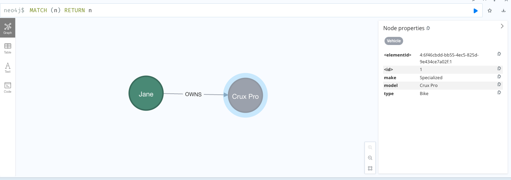

# Creating and Visualizing Graphs in Neo4j

This tutorial provides a step-by-step guide on how to create nodes and relationships in Neo4j using the Cypher query language, and how to visualize them using the Neo4j Browser.

## Overview

In this example, we will create a simple graph representing a `Person` who owns a `Vehicle`. This model will help demonstrate the basics of graph database concepts including nodes, relationships, and properties.

## Prerequisites

- Neo4j installed (either Desktop or Aura)
- Access to the Neo4j Browser

## Step 1: Creating the Graph

We will begin by creating a `Person` node and a `Vehicle` node, and a relationship `OWNS` between them. Each node and relationship will have properties that describe them further.

### Cypher Query

```cypher
CREATE (p:Person {name: "Jane"})-[:OWNS {since: 2018}]->(v:Vehicle {type: "Bike", make: "Specialized", model: "Crux Pro"})
RETURN p, v

This query does the following:
- **`CREATE`**: Initializes the nodes and relationship.
- **`(p:Person {name: "Jane"})`**: Creates a node with the label `Person` and a property `name` set to "Jane".
- **`[:OWNS {since: 2018}]`**: Creates a relationship of type `OWNS` from the `Person` to the `Vehicle`, with a property `since` indicating the year the vehicle was owned.
- **`(v:Vehicle {type: "Bike", make: "Specialized", model: "Crux Pro"})`**: Creates a node with the label `Vehicle` and properties `type`, `make`, and `model`, describing the vehicle owned by Jane.

## Step 2: Visualizing the Graph

After executing the above query in the Neo4j Browser, the nodes and relationships you created will be displayed visually.

### Viewing the Graph

The Neo4j Browser provides a graphical representation of the data. Here, you can interact with the nodes and relationships:

- **Nodes**: Represented as circles; you can click on each node to view and edit its properties.
- **Relationships**: Shown as lines connecting the nodes; clicking on a relationship will show its properties.
- **Layout**: You can drag nodes around to organize the display to your liking.



The image above demonstrates how the graph appears in the Neo4j Browser, illustrating the `Person` node connected to the `Vehicle` node via the `OWNS` relationship.
